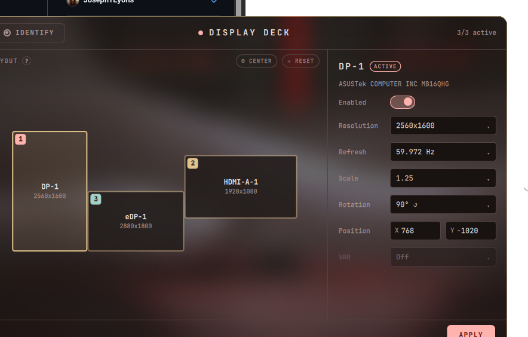

# Display Deck

A native [Quickshell](https://quickshell.org/) / QML monitor manager for the
[niri](https://github.com/YaLTeR/niri) Wayland compositor. It reads live outputs
from `niri msg`, lets you arrange, scale, rotate and toggle displays on a visual
canvas, then writes both the running state (`niri msg output …`) and a persistent
`~/.config/niri/monitor.kdl`.



## Features

- **Visual layout canvas** — drag screens to position them, with edge snapping and
  collision resolution so niri never silently rejects an overlapping placement.
  - **Left-drag** a screen to move it.
  - **Right-drag** anywhere to pan the view.
  - **◎ CENTER** re-fits and centers every screen; **⊹ RESET** packs them edge-to-edge.
- **Per-output controls** — enable/disable, resolution, refresh rate, scale,
  rotation, explicit X/Y position, and VRR (when supported).
- **Identify** — flashes a numbered frosted panel on each physical monitor.
- **Adaptive theming** — colors are read from
  `~/.config/niri/colors.json` or `~/.config/noctalia/colors.json`
  ([Noctalia](https://github.com/noctalia-dev/noctalia-shell) Material palette), with
  an amber (theme tertiary) stroke accent throughout. Falls back to a built-in dark
  theme if neither file exists.
- **Real compositor blur** via niri's KDE-blur protocol.

## Requirements

- `niri` (with `niri msg --json` support)
- `quickshell` (`qs` on `PATH`)
- `python3` (used by the launcher to find an existing window)

## Install

```sh
git clone <your-remote> ~/Projects/display-deck
cd ~/Projects/display-deck
./install.sh
```

`install.sh` symlinks `bin/niri-displays` → `~/.local/bin/` and
`qml/shell.qml` → `~/.local/share/niri-displays/qml/`, so the cloned repo stays
the single source of truth — edits here are live.

Add a niri keybind (in `~/.config/niri/config.kdl`):

```kdl
binds {
    Mod+Shift+T { spawn "niri-displays"; }
}
```

## Usage

Run `niri-displays` (or the bind). The launcher is single-instance: if a Display
Deck window is already open it focuses it instead of spawning a duplicate.

Arrange your displays, then hit **APPLY** — it applies live and writes
`~/.config/niri/monitor.kdl` (backing up the previous one to `monitor.kdl.bak`).
Include that file from your niri config to persist across reboots:

```kdl
// in ~/.config/niri/config.kdl
include "monitor.kdl"
```

## License

MIT — see `LICENSE` (add your own).
